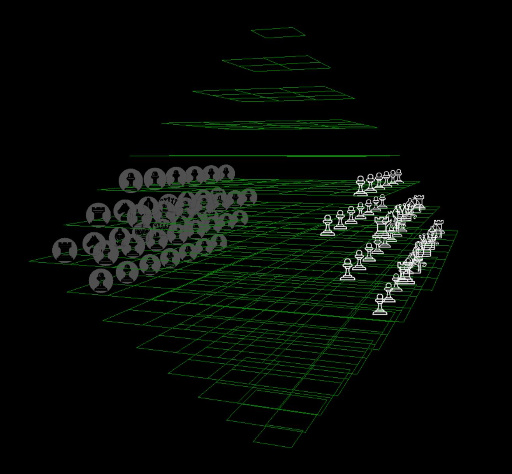
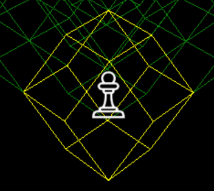
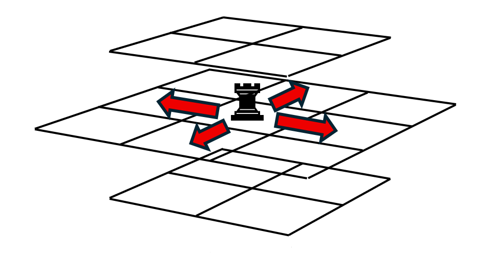
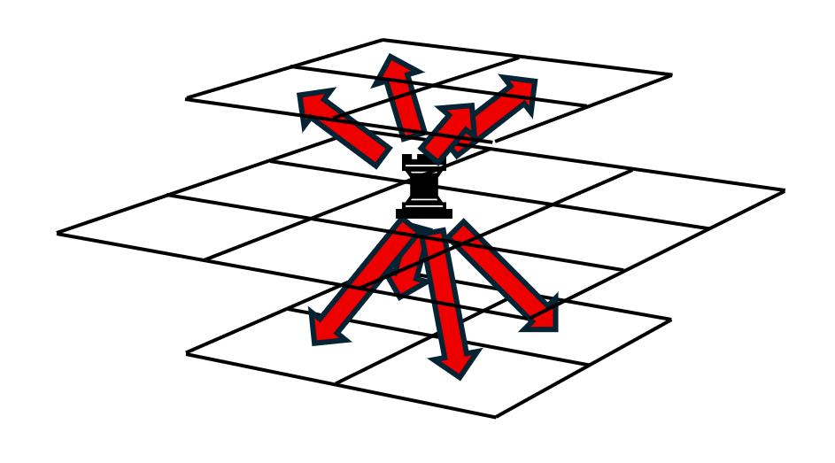
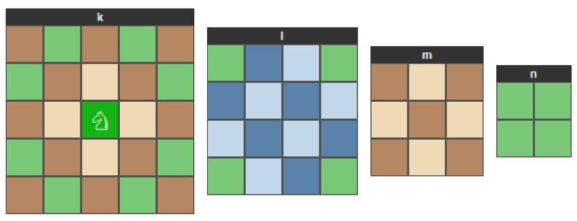

# How to Play 4D Chess

Welcome to **WinAmy4D**, a four-dimensional variant of chess.

If you already know standard chess, you know almost everything you need
to play. 4D chess uses **all the same pieces, all the same special
rules, and the same overall objective** — checkmate your opponent's king.
What changes is the *playing field*: instead of a single 8×8 board, you
play on a stack of fifteen boards of varying sizes that together form a
single, three-dimensional playing space. This guide walks you through the
board, explains why it's called "4D," shows you the starting position,
and describes how each piece moves.

> **One-sentence summary**: 4D chess is regular chess on a stepped pyramid
> of fifteen boards, where every piece keeps the move it has in regular
> chess and gains natural extensions of that move into the third (and
> fourth) dimensions.

---

## 1. The Playing Board

### Fifteen levels, stacked

The playing area is made up of **fifteen levels**, labelled with letters
**`a`** through **`o`** (the first fifteen letters of the alphabet).

Each level is its own square board, but the boards are not all the same
size. They form a **stepped pyramid** that grows from a single square at
the very bottom, up to a full 8×8 board in the middle, and then tapers
back down to a single square at the very top:

| Level | Size  | Notes                                               |
|:-----:|:-----:|-----------------------------------------------------|
|  `o`  | 1 × 1 | the top point of the pyramid                        |
|  `n`  | 2 × 2 |                                                     |
|  `m`  | 3 × 3 |                                                     |
|  `l`  | 4 × 4 |                                                     |
|  `k`  | 5 × 5 |                                                     |
|  `j`  | 6 × 6 |                                                     |
|  `i`  | 7 × 7 |                                                     |
| **`h`** | **8 × 8** | **the main board — standard chess board**       |
|  `g`  | 7 × 7 |                                                     |
|  `f`  | 6 × 6 |                                                     |
|  `e`  | 5 × 5 |                                                     |
|  `d`  | 4 × 4 |                                                     |
|  `c`  | 3 × 3 |                                                     |
|  `b`  | 2 × 2 |                                                     |
|  `a`  | 1 × 1 | the bottom point of the pyramid                     |

That's **344 squares** in total. 

A side-on silhouette of the stack:

**Level `h` is the standard chessboard.** If you played a game that used
only level `h`, you would be playing regular chess: the same eight files
(a–h), the same eight ranks (1–8), the same starting position, the same
moves, the same rules.

The other fourteen levels add space above and below the main board, into
which pieces can move when their movement carries them off the main
board. Think of them as the "rooms upstairs and downstairs" of a normal
chess game.

### Viewing the board

The app offers two views of the board:

- **2D view**: shows all fifteen levels laid out side-by-side, arranged
  in three rows so they fit on your screen. Easiest for reading exact
  positions.
- **3D view**: shows the levels as a true stack in three-dimensional
  space, which makes vertical (cross-level) relationships much easier
  to see. Several "grid" orientations are available — see *Why is it
  called 4D chess?* below for what those are.

A toolbar button toggles between the two views. **Most players find the
3D view essential once pieces start moving between levels.**

### 2D vs 4D chessboard

A traditional 2D chess board is made up of 64 squares, each with four squares that are edge adjacent (because they share the same edge) and 4 that are diagonally adjacent (because they only touch at the corners).

In 4D chess, each chessboard location is a 3D shape.  Although it might seem obvious the "square" chess squares would become cubes in 3D, in 4D chess, a 4 dimensional geometry is used, which results in a  12 sided polyhedron called a  rhombic dodecahedron, which is a 4 dimensional hypercube projected into 3 dimensions, but its not as complicated as it sounds.

In 4D chess, on every level is a has either 8x8, 7x7, 6x6, down to 1x1 grid of chess spaces.  They aren’t technically squares (because they are 3 dimensional), but when you look at them on a single level they appear 2 dimensionally as a square.  The is because the board is a slice through the middle of the dodecahedron at an angle that is an exact square.

From this perspective, each "square" again has four squares that are edge adjacent (because they share the same edge) and 4 that are diagonally adjacent (because they only touch at the corners, exactly like a normal 2D chess board.  But, if you go up one level or down one level, there are another 4 "squares" that are immediately above or below the current "square".  Because each board level is either one square bigger or smaller, the center of each level on the starting board is immediately above or below the corner of the 4 "squares" above or below it.  When you looks at this in 3 dimensions, the 4 edge adjacent squares on the first board are actually face adjacent to the other 4 "squares" in 3 dimensions, but are also face adjacent to the 4 "squares" above or below.  In other words, each "square" in 3 dimensions has 12 faces, 4 "face" adjacent to other "squares" on the same level, 4 face adjacent  to the 4 "squares" above, and 4 face adjacent to the "squares" on the level below.  Because the "square" actually has 12 faces, it is a 3 dimensional dodecahedron, a polyhedron with 12 faces.  So, from  now one we will just call this a board location, but you should remember it is a 3 dimensional rhombic dodecahedron.

For purposes of actually playing, you only need to remember:

- Pieces still move in straight lines, L-shapes, and so on — just like
  regular chess.
- Those lines now include directions that pass between levels.
- The 3D view's Hex grids let you see those between-level lines clearly.

---

## 3. How the Pieces Move

Every piece keeps the move it has in regular chess. In 4D chess, each of
those moves is **extended** in a natural way so that the piece can also
travel between levels.

A useful rule of thumb: **if a move would be legal in regular chess on
level `h`, it is also legal here.** The new options are *additions*, not
replacements.

When you click on a piece in the app, every square it can legally move to
lights up. This is the fastest way to learn the new directions — but
here is the conceptual description for each piece.

### The Pawn ♙ ♟

- **Forward move.** A pawn pushes one square *forward* (toward the
  opponent's side) on its own level. As in regular chess, it never moves
  backward and never captures with this forward push.
- **Double first move.** The two-square first move is allowed **only on
  the main 8-wide level `h`**. From its starting rank on level `h`, a pawn
  may push two squares forward instead of one — provided both squares are
  empty — exactly like a regular chess pawn. On every other level a pawn
  always advances a single square at a time, even from its starting rank.
- **Diagonal capture.** A pawn captures diagonally forward — and it has
  *two kinds* of diagonal:
  1. The standard forward-left / forward-right diagonal **on its own
     level** (exactly as in regular chess).
  2. A diagonal that carries it forward into a square on a **neighbouring
     level** above or below.

  In both cases the destination must contain an enemy piece (or be the
  en-passant square — see below).
- **En passant.** Because the two-square double push only happens on
  level `h`, *en passant* captures are likewise only possible on level
  `h`. Just as in regular chess, if a pawn double-pushes past a square
  that an enemy pawn could have captured it on, that enemy pawn may
  capture *en passant* on its very next move.
- **Promotion.** When a pawn reaches the **far rank** of one of the
  central levels (levels `f`, `g`, `h`, `i`, or `j`), it must promote
  to a Queen, Rook, Bishop, or Knight, as in regular chess.

> On level `h` only, the pawn behaves *exactly* like a regular chess pawn.

### The Rook ♖ ♜

Looking at how each location on the board is face adjacent to 12 other locations, the movement of the rook follows those same face adjacent paths.  So, on the starting 2D board, there are 4 face adjacent locations (squares) where the rook can move along the rank or file (rows and columns) of the starting board, EXACTLY like a normal 2D chess rook.  

But, to move up or down between levels, since all 4 locations on the boards above or below the starting board are all centered exactly above or below the starting location, the rook can move into any one of those 4 space directly above or below the starting location.  

In other words, it can move into any of the 12 locations which are face adjacent to the original location, and obviously continue moving along that direction until it reaches the edge of the board or is blocked by another piece.  This is because, again, the board location in 3D is really a 12 sided rhombic dodecahedron.   You can see this if you select the “Full Dodecahedron” mode in 3D view, although there are a lot of vertices to render so you will need to zoom in and rotate the board back and forth to be able to distinguish each cell.  Also, selecting a single piece will highlight just that one dodecahedron to make it stand out.

Another way to visualize the moves for each piece on the 2D view is by changing the perspective.  If you look at all 15 boards together, they make an 8 sided double pyramid shape, also called an octahedron.  This board shape is aligned with x, y, and z coordinates in the direction of the 6 corners of the board.  Plus and minus z points to the top and bottom squares of the board.  On the main 8x8 board, level h, the plus x axis points to the top right corner of the board and minus x points to bottom left.  Plus y points to the top left and minus y points to bottom right.  Because of this, you can spin the board on any one of the x, y, and z axis, and look at it along the x/z plane or the y/z plane.  When you do this, all the rook moves that would be up or down across levels now are all aligned on the same board, so you can more easily see how the rook moves attack different squares on different levels just by changing the perspective you view the board from.  This is a good way to check the location you make a move to to see what other locations can be attacked from that position.

### The Bishop ♗ ♝

While the rook follows moves along the 12 faces of the dodecahedron, the bishop can move along the corners.  This is directly similar to how it moves in 2D chess, from the corner of one square to the corner of the next square, moving in between two other squares.  In 3D, the rhombic dodecahedron has 6 corners where the acute or “pointy” ends of the faces meet.  There are also 8 corners where 3 the obtuse corners of adjacent faces meet, but those don’t count for the bishop.  The 6 acute or “pointy” corners align with the x, y and z axes in plus and minus directions, so you can think of the bishop as moving along those 3 cardinal directions in 3D.  

This means the bishop can move diagonally in 6 directions.  On the normal 2D chess board, these are the usual 4 diagonals on the chessboard.  But, when moving up or down between levels, the bishop moves “between” the corners of the four “squares” (board locations) directly above the current location, to the next location directly above or below that location.  In other words, when moving up or down along the z direction, the bishop skips a level and moves 2 levels up or down with each move.  

Again, and easy way to see this is by changing the x/y plane on the 2D board, because again, when you spin the board on its axes, the moves of all the pieces are exactly the same regardless of which perspective you view it from.  So, when viewing from the x/z plane, the moves up or down along the z axis are simply a diagonal move between squares on the 2D board.

In normal 2D chess, because the bishop only moves along a diagonal, each bishop always stay on their starting color.  But this also includes moving vertically.  Because they always skip a level when moving vertically, a bishop that starts on an odd numbered level always stays on an odd numbered level, and vice versa.  This also means that for each of the 4 bishops on each side, there are two that start on an odd level and two on an even level, so that for each side no two bishops can ever land on the same square of another bishop.  Each is confined to its own color and its own odd or even numbered levels.

### The Queen ♕ ♛

Just like in 2D chess, the queen combines the moves of the bishop and the rook.  That's all.  This makes the queen, just like in 2D chess, the most powerful piece on the board.  But compared to 2D chess, the 2D queen has only 8 directions to move in, in 3D it is 18, arguably even more powerful than the same piece in 2D.

### The Knight ♘ ♞

Just like in 2D chess, the knight can be the most complicated piece to understand how it moves.  But, like the other pieces, the knight moves in the same L shape, but in 3D.
There are 2 ways to look at the L, either 3 moves out (like the rook) and then a right angle turn and another 2 squares, or you can look at it as moving one square out (like a rook) followed by 1 in a diagonal direction (like a bishop).  The problem is, in 3D, a 90 degree turn can be in any direction, up down left or right.  But for the knight, the right (or left) had turn must only be along the plane of the original move.  So, counting 12 directions for the first move, then turning either left or right, this makes a total of 24 possible locations the knight can jump to from their current location.   
This can be very difficult to visualize and even harder to plan in 3D, so the best way to look at the knight’s moves is on the 2D board view.

### The King ♔ ♚

- **One square in any direction.** The king moves exactly one square in
  any direction the queen would move — that is, any direction along
  which a bishop, rook, or queen could slide. This includes one-square
  moves *between levels*.
- **Castling.** See *Special Rules* below.

> On level `h` only, the king behaves exactly like a regular king (eight
> possible single-square moves, plus castling).

---

## 4. Setting Up the Pieces

Both sides start with a familiar standard-chess army (eight pawns and the
usual king, queen, two rooks, two bishops, two knights) **plus** a number
of additional pieces and pawns spread over the middle levels of the
pyramid.

The initial setup occupies only **four of the fifteen levels**, with
levels `a`–`f` and `k`–`o` starting empty:

| Level | Size  | White's back rank → forward                       | What's on it                                |
|:-----:|:-----:|--------------------------------------------------|---------------------------------------------|
|  `g`  | 7 × 7 | (none — pawns only)                              | One row of **7 pawns** for each side       |
| **`h`** | **8 × 8** | **R N B Q K B N R**                            | **Full standard chess starting position**   |
|  `i`  | 7 × 7 | **R N B Q B N R** (no king)                      | Pieces plus one row of 7 pawns each side    |
|  `j`  | 6 × 6 | (none — pawns only)                              | One row of **6 pawns** for each side       |

A few important things to notice:

- The **kings live only on level `h`**, and there is exactly one king per
  side, just like in standard chess. There are no extra kings on any
  other level.
- White's pieces begin on the side of each level closest to White (the
  "first rank" of that level); Black's pieces begin on the opposite
  side, mirroring White.
- White moves first.

If you ignore everything except level `h`, the starting position **is
the starting position of regular chess**. The other three levels (g, i,
j) are extra forces stacked above and below the main board.

---

## 5. Special Rules (Same as Regular Chess)

The special rules of regular chess all apply, with one small extension
already noted (pawn promotion) and one small restriction (where
castling can happen).

- **Promotion.** A pawn that reaches the far rank of any of the central
  levels (`f`, `g`, `h`, `i`, `j`) **must** promote to a Queen, Rook,
  Bishop, or Knight on the same move. Promotion is identical to regular
  chess in every other respect.
- **Castling.** Castling is exactly the regular-chess move: king and
  rook trade places under the well-known conditions (neither piece has
  moved, no pieces between them, the king is not currently in check,
  and the king does not pass through or land on a square attacked by
  the opponent). **Castling is only available on the main board (level
  `h`)** — that is, between the king and his original level-`h` rooks.
- **En passant.** Identical to regular chess and, like the two-square
  push, **only possible on the main board (level `h`)**. If a pawn makes
  a two-square push past a square that an enemy pawn could have captured
  it on, the enemy pawn may capture it *en passant* — but only on the
  very next move.
- **Check and checkmate.** A king is **in check** when any enemy piece
  attacks the square it stands on. The player on move must always
  respond to check (by moving the king, blocking the attack, or
  capturing the attacker). If there is no legal response, it is
  **checkmate** and that player loses. Since both kings live on level
  `h`, all checks ultimately resolve there — but the *attacking* piece
  may be on any level whose movement reaches the king.
- **Stalemate.** If the player on move has no legal moves *and* is not
  in check, the game is a **draw** by stalemate, exactly as in regular
  chess.
- **Turn order.** White moves first, then Black, alternating.

---

## 6. How to Win, How to Draw

The objective is **checkmate the opposing king**, exactly as in regular
chess. The game also ends in a draw under all the familiar conditions:
stalemate, insufficient material, agreed draw, and so on.

---

## 7. Tips for New Players

- **Start with level `h`.** Until you are comfortable spotting threats
  across multiple levels, treat level `h` as your "main theatre" and
  play it like a regular game of chess. The other levels will start to
  matter as pieces drift into them.
- **Turn on the 3D view.** The 2D view is fine for reading exact
  positions, but the 3D view is much better for spotting threats that
  cross between levels — and those are the threats that catch beginners
  out.
- **Try each Hex grid.** The four Hex orientations in the 3D view's
  grid menu each show you cells aligned along a different one of the
  underlying 4D diagonals. Trying all four is the quickest way to
  develop an intuition for cross-level lines.
- **Watch above and below your king.** A piece on level `g` or level
  `i` (or further) can deliver check to your king on level `h`. If you
  only watch level `h`, you will miss those threats.
- **Click your pieces.** When you click on any of your pieces, every
  legal destination lights up. Use this freely — there is no penalty
  for clicking around to learn the moves.

---

## 8. Quick Reference

| | |
|---|---|
| Number of levels | 15 (`a`–`o`) |
| Total squares | 344 |
| Main board | level `h` (8 × 8) — standard chessboard |
| Starting position occupies levels | `g`, `h`, `i`, `j` |
| Kings | one per side, on level `h` only |
| Pieces | same as standard chess (pawn, knight, bishop, rook, queen, king) |
| Special rules | promotion, castling (level `h` only), en passant (level `h` only), two-square pawn first move (level `h` only) — otherwise identical to regular chess |
| Objective | checkmate the opposing king |

Enjoy the game!
